# Awesome Cosplay Building 

> A curated list of materials, suppliers, tools, techniques, and planning resources for cosplay builders. Real products, real prices, real opinions.

  

This isn't a generic link collection. Every item here has been used, tested, or verified by builders who make costumes for conventions. If something is expensive, we say so. If something has a cheaper alternative that works, we list it.

---

## Contents

- [Materials](#materials)
  - [EVA Foam](#eva-foam)
  - [Foam Alternatives](#foam-alternatives)
  - [Thermoplastics](#thermoplastics)
  - [Adhesives](#adhesives)
  - [Primers and Sealants](#primers-and-sealants)
  - [Paints and Finishes](#paints-and-finishes)
  - [Casting and Molding](#casting-and-molding)
  - [Fabric and Textiles](#fabric-and-textiles)
  - [Wigs](#wigs)
  - [LEDs and Electronics](#leds-and-electronics)
  - [Prosthetics and Body Paint](#prosthetics-and-body-paint)
- [Suppliers](#suppliers)
  - [Cosplay-Specific Suppliers](#cosplay-specific-suppliers)
  - [General Craft and Hardware](#general-craft-and-hardware)
  - [Fabric and Textiles](#fabric-and-textile-suppliers)
  - [International Suppliers](#international-suppliers)
- [Tools](#tools)
  - [Starter Kit ($50-80)](#starter-kit-50-80)
  - [Intermediate Kit ($150-250)](#intermediate-kit-150-250)
  - [Advanced Kit ($400+)](#advanced-kit-400)
- [Safety](#safety)
  - [Respirators](#respirators)
  - [Eye Protection](#eye-protection)
  - [Gloves](#gloves)
  - [Ventilation](#ventilation)
  - [Chemical Safety Quick Reference](#chemical-safety-quick-reference)
  - [Common Injuries](#common-injuries)
  - [Starter Safety Kit](#starter-safety-kit)
- [Techniques](#techniques)
  - [EVA Foam Working](#eva-foam-working)
  - [Sewing for Costumes](#sewing-for-costumes)
  - [Painting and Finishing](#painting-and-finishing)
  - [3D Printing for Cosplay](#3d-printing-for-cosplay)
  - [Prop Making](#prop-making)
  - [Fabric Modification](#fabric-modification)
  - [Body Forms and Fitting](#body-forms-and-fitting)
- [Wearing Your Costume](#wearing-your-costume)
  - [Strapping Systems](#strapping-systems)
  - [Padding and Comfort](#padding-and-comfort)
  - [Staying Cool](#staying-cool)
  - [Undersuits](#undersuits)
  - [Mobility and Bathroom Access](#mobility-and-bathroom-access)
  - [Helmet Visibility](#helmet-visibility)
  - [Skin Adhesives](#skin-adhesives)
- [Learning](#learning)
  - [YouTube Channels](#youtube-channels)
  - [Books](#books)
  - [Courses](#courses)
- [Communities](#communities)
  - [Reddit](#reddit)
  - [Forums](#forums)
  - [Social Media](#social-media)
  - [Discord](#discord)
  - [Marketplaces](#marketplaces)
  - [Convention Databases](#convention-databases)
- [Photography](#photography)
  - [Posing in Armor](#posing-in-armor)
  - [Working with Photographers](#working-with-photographers)
  - [Lighting and Finishes on Camera](#lighting-and-finishes-on-camera)
  - [Finding Good Spots at Cons](#finding-good-spots-at-cons)
  - [Cosplay Gatherings](#cosplay-gatherings)
- [Competition](#competition)
  - [What Judges Look For](#what-judges-look-for)
  - [Build Books](#build-books)
  - [Walk-On vs. Skit](#walk-on-vs-skit)
  - [Common Mistakes](#common-mistakes)
- [Planning](#planning)
  - [Budget Templates](#budget-templates)
  - [Convention Tracking](#convention-tracking)
  - [Convention Checklists](#convention-checklists)
  - [Transportation](#transportation)
  - [Storage](#storage)
  - [Commission Pricing](#commission-pricing)
  - [Planning Tools Comparison](#planning-tools-comparison)
  - [Craft and Hobby Tools](#craft-and-hobby-tools)
- [Cost References](#cost-references)
- [Sources](#sources)
- [Contributing](#contributing)

---

## Materials

### EVA Foam

The most common cosplay armor material. Cheap, forgiving, and cuttable with a craft knife. Comes in sheets of varying thickness.

| Thickness | Best for | Approx. cost |
|-----------|----------|-------------|
| 2mm | Details, trim, overlays | $3-5/sheet |
| 4mm | Smaller armor pieces, bracers | $5-7/sheet |
| 6mm | Standard armor panels, pauldrons | $6-8/sheet |
| 10mm | Large structural pieces, shields | $8-12/sheet |

- [TNT Cosplay Supply EVA foam](https://www.tntcosplaysupply.com) - Cosplay-grade foam in multiple thicknesses and colors. The community standard.
- [SKS Props foam](https://www.sksprops.com) - High-density EVA foam, good selection of thicknesses. Ships from US.
- [Harbor Freight anti-fatigue mats](https://www.harborfreight.com/4-piece-anti-fatigue-foam-mat-set-94635.html) - Budget EVA foam. $8 for a 4-pack. Textured on one side but workable. Many first builds start here.
- [Lumin's Workshop Foam Clay](https://www.luminsworkshop.com/en-us/collections/foam-clay) - Moldable foam clay for organic shapes and gap filling. Air-dries to a sandable surface.

### Foam Alternatives

EVA sheets aren't your only option. Each of these fills a gap that standard EVA can't.

- **Sintra / PVC foam board** ([Cosplay Supplies Inc](https://cosplaysupplies.com/products/sintra-plastic-sheet), [Curbell Plastics](https://www.curbellplastics.com/product-category/material/expanded-pvc/sintra-expanded-pvc/)) - Lightweight rigid panels. Smooth on both sides, holds paint beautifully, doesn't absorb moisture. $12-30 per 18"x24" sheet depending on thickness. Best for flat, geometric armor that needs to stay stiff. Terrible for curves.
- **L200 / Plastazote foam** ([Foam Mart](https://foammart.com/product/l200-12-blackwhite/)) - Cross-linked polyethylene foam. Denser and firmer than standard EVA, completely smooth out of the package (no floor-mat texture to sand off). Holds crisp edges and sands to a clean finish. $18-75 per large sheet. Worth it for competition builds where surface quality matters. Semi-translucent in thin sheets, so LEDs can shine through it.
- **Pool noodles** - $1-2 at any dollar store. Perfect for horns, tubes, and rounded shapes. Carve them with an electric knife, then coat with foam clay or paper mache before painting (paint won't stick to raw pool noodle). The go-to for large tiefling/Maleficent horns because they're dirt cheap and weigh nothing.
- **Craft foam** (thin sheets from Michaels, Dollar Tree) - Same material as EVA, just thinner (1-3mm). $1-5 per multi-pack. Use for detail layers, filigree, inlays, and surface accents on top of thicker EVA. Too thin and floppy to be structural.
- **Yoga mats** - Budget thin EVA, 4-6mm. A 68"x24" mat costs $5-15, giving you ~11 sq ft of foam for less than a single cosplay-grade sheet. The catch: most have a textured surface you'll need to sand off or heat-seal. Fine for hidden or painted-over pieces.

### Thermoplastics

Heat-formable sheets for rigid armor, structural elements, and complex curves. More expensive than foam but more durable.

- [Worbla](https://www.worbla.com) - The standard thermoplastic for cosplay. Self-adhesive when heated. ~$38-46/sheet (prices have risen). Multiple variants: Finest Art (smooth), Black Art (easier to see details), Mesh Art (structural).
- [Wonderflex](https://www.wonderflexworld.com/) - Cheaper alternative to Worbla. Needs an external adhesive. Good for flat or gently curved pieces.
- [Thibra](https://www.thibra.com/) - Similar to Worbla with finer detail capability. Popular in Europe.
- [Cosclay](https://www.cosclay.com) - Flexible polymer clay that stays flexible after baking. Good for sculpted details and gap filling.

### Adhesives

| Adhesive | Best for | Dry time | Cost | Notes |
|----------|----------|----------|------|-------|
| [Barge All-Purpose Cement](http://www.bargeadhesive.com) | Structural foam bonds | 15-30 min | $15-20 | The gold standard. Apply to both surfaces, wait until tacky, press once. Bond is permanent. **Warning:** buy from hardware stores, not Amazon (counterfeits). |
| [DAP Weldwood Contact Cement](https://www.dap.com/products-projects/our-brands/weldwood/original-contact-cement/) | Budget foam bonding | 15-30 min | $8-12 | Cheaper Barge alternative. Slightly weaker bond but fine for most builds. |
| [E6000](https://eclecticproducts.com/product/e6000-industrial-adhesive/) | Detail work, mixed materials | 24-72 hrs | $5-8 | Industrial adhesive. Flexible when cured. Strong fumes, use ventilation. |
| Hot glue | Quick tacks, non-structural | Instant | $5 | Fast but brittle. Will melt at outdoor summer cons. Not for structural bonds. |

### Primers and Sealants

Foam absorbs paint. You must seal it first or your paint job will look terrible.

- [Rosco FlexBond](https://us.rosco.com/en/product/flexbond) - The community favorite foam primer. Flexible, sandable, 3-4 thin coats. ~$14/bottle, covers multiple builds.
- [Plasti Dip](https://plastidip.com) - Rubberized spray coating. Quick to apply, decent flexibility. Can obscure fine details if applied too thick. ~$8-12/can.
- [Mod Podge](https://plaidonline.com/brands/mod-podge) - Budget sealer. Works in a pinch but less flexible than FlexBond. Not ideal for armor that needs to flex. ~$5-8.
- [Kwik Seal caulk](https://www.dap.com/products-projects/product-categories/caulks-sealants/latex/kwik-seal/) - Silicone caulk thinned with water. Budget primer option. Apply thin coats. ~$5.
- [XTC-3D by Smooth-On](https://www.smooth-on.com/products/xtc-3d/) - Self-leveling epoxy for 3D prints. Fills layer lines. ~$25/kit.

### Paints and Finishes

- **Acrylic craft paints** (Apple Barrel, FolkArt) - $1-3 each. Fine for base coats and large areas. The hobby entry point.
- **Spray paints** ([Krylon](https://www.krylon.com), Rustoleum) - $5-8/can. Good for large, even coverage. Use primer first.
- **Airbrush paints** (Createx, Vallejo) - Best finish quality but requires an airbrush setup ($80-200+).
- [Rub 'n Buff by AMACO](https://shop.amaco.com/mixed-media/metallic-finishes/rub-n-buff/) - Metallic wax finish. The easiest way to make foam look like real metal. Apply with a finger. ~$8/tube.
- **Weathering washes** - Thin black/brown acrylic into crevices for depth. Free if you already have paint. The single biggest upgrade to any armor paint job.

### Casting and Molding

For duplicating parts, making smooth props, or mass-producing accessories.

- [Smooth-On Mold Star 15](https://www.smooth-on.com/products/mold-star-15-slow/) - Platinum silicone for flexible molds. ~$25-40/kit.
- [Smooth-On Smooth-Cast 300](https://www.smooth-on.com/products/smooth-cast-300/) - Urethane casting resin. ~$20-30/kit.
- [Apoxie Sculpt by Aves Studio](https://avesstudio.com/shop/apoxie-sculpt/) - Two-part epoxy sculpting compound. Self-hardening, sandable, paintable. Great for seam filling and sculpted details. ~$15-20.

### Fabric and Textiles

| Fabric | Best for | Price/yard | Notes |
|--------|----------|-----------|-------|
| Cotton broadcloth | Linings, base layers | $4-8 | Breathable, easy to sew |
| Stretch spandex/lycra | Bodysuits, undersuits | $8-15 | 4-way stretch. Use a ballpoint needle. |
| Faux leather/pleather | Belts, armor accents, straps | $10-20 | Cuts clean, doesn't fray. Use clips, not pins. |
| Duck canvas | Structural elements, pouches | $8-12 | Heavy duty. Good for bags and structured garments. |
| Organza/tulle | Skirts, capes, fairy wings | $3-8 | Multiple layers for opacity. |
| Stretch velvet | Formal costumes, cloaks | $12-20 | Luxurious drape. Tricky to sew (use a walking foot). |

### Wigs

- [Arda Wigs](https://arda-wigs.com) - Pre-styled cosplay wigs, good fiber quality. ~$30-50. Great for beginners.
- [Epic Cosplay Wigs](https://www.epiccosplay.com) - 900+ styles, heat-resistant fiber, long wigs. ~$25-45.
- **Amazon/AliExpress wigs** - $12-25. Quality varies wildly. Fine for casual cosplay, risky for competition.
- **Wig care:** Got2b Freeze Spray for spikes (still the community standard, though some regions are seeing reformulations; Kenra Volume Spray 25 and Schwarzkopf Session Label are alternatives). Wide-tooth comb for detangling, wig head for storage. Never ball up a wig in a bag.

### LEDs and Electronics

- [Adafruit NeoPixels](https://www.adafruit.com/category/168) - Individually addressable RGB LEDs. The standard for cosplay lighting. Pair with an Arduino Nano.
- [EL wire](https://www.adafruit.com/category/50) - Flexible glowing wire for Tron-style lines. Runs on batteries, easy to install. ~$8-15/roll. Photographs much better than LEDs (smooth glow vs. visible dots).
- **LED strips** (WS2812B) - Cheaper NeoPixel alternatives on AliExpress. ~$3-8 per meter. Same protocol.
- **Coin cell batteries + LED throwies** - Cheapest lighting option. Tape a coin cell to an LED, stuff it in a translucent prop. $0.50/light.

### Prosthetics and Body Paint

For creature cosplay, alien skin, elf ears, horns, and full-body color.

**Prosthetic pieces:**

- [Aradani Costumes](https://www.aradanicostumes.com/) - The standard for elf ears. Latex ($10-25), silicone ($25-45), and neoprene (hypoallergenic). Also sells slip-cast horns.
- [MostlyDead](https://www.mostlydead.com/) - Foam latex horns, noses, brow ridges, forehead appliances. $15-175 depending on complexity.
- [CFX Composite Effects](https://compositeeffects.com/) - Full silicone character masks starting ~$600. The gold standard for full-face creature transformations.

**Body paint:**

| Brand | Type | Coverage | Price | Best for |
|-------|------|----------|-------|----------|
| [Mehron Paradise AQ](https://www.mehron.com/paradise-makeup-aq/) | Water-activated | Excellent | $9-15/color | Color vibrancy, smooth application. Removes with soap and water. |
| [Kryolan Aquacolor](https://www.kryolan.com) | Water-activated | Extremely pigmented | ~$22/30ml | Best value for full-body coverage. A single small pan can cover ~75% of a body. |
| Snazaroo | Water-activated | Decent | $5-10/palette | Face painting and casual use only. Rubs off too easily for full-body con wear. |

**When to use prosthetics vs. foam:** Anything touching your face (ears, noses, brow ridges, cheekbones) needs silicone or latex prosthetics that flex with facial movement. Structural features that sit away from the face (horns on a headband, shoulder-mounted appendages, helmet-integrated mandibles) are better built from foam or 3D printed.

---

## Suppliers

### Cosplay-Specific Suppliers

| | Supplier | Speciality | Ships from | Notes |
|---|----------|-----------|-----------|-------|
|  | [TNT Cosplay Supply](https://www.tntcosplaysupply.com) | EVA foam, foam clay, patterns | US | The go-to for foam. Good customer service. |
|  | [SKS Props](https://www.sksprops.com) | EVA foam, tools, kits | US | High-density foam options, bulk discounts. |
|  | [Worbla](https://www.worbla.com) | Thermoplastic sheets | Germany (US distributors) | Order from a US distributor to save on shipping. |
| | [Lumin's Workshop](https://www.luminsworkshop.com) | Foam clay, tools, tutorials | UK/US | Lumina Clay is the foam clay community standard. |
| | [Bronavaro](https://bronavaro.com/) | EVA foam patterns, pepakura PDO files | EU | Downloadable armor patterns. Good if you don't want to draft from scratch. |

### General Craft and Hardware

- [Harbor Freight](https://www.harborfreight.com) - Budget tools, heat guns, Dremel alternatives, safety gear. Where you buy your first heat gun.
- [Home Depot](https://www.homedepot.com) / [Lowe's](https://www.lowes.com) - Contact cement, PVC pipe, spray paint, sandpaper, hardware.
- [JOANN Fabrics](https://www.joann.com) - Fabric, interfacing, thread, notions. Use the 40-60% off coupons (they always have them).
- [Michaels](https://www.michaels.com) - Craft paint, brushes, Mod Podge, foam sheets (thin).
- [Amazon](https://www.amazon.com) - Everything else. **Caution:** Barge cement on Amazon is frequently counterfeit. Buy from hardware stores.

### Fabric and Textile Suppliers

- [Mood Fabrics](https://www.moodfabrics.com) - High-end fashion fabrics. Expensive but excellent quality.
- [Spandex House](https://spandexhouse.com) - Spandex and stretch fabrics for bodysuits and undersuits.
- [Dharma Trading](https://www.dharmatrading.com) - Dyeable fabrics and dye supplies. Also the best source for professional-grade Procion MX fiber reactive dyes.

### International Suppliers

- **UK:** [Coscraft](https://www.coscraft.co.uk) (foam, Worbla, tools)
- **EU:** [Worbla.com](https://www.worbla.com) (direct), [CosplayShop.be](https://www.cosplayshop.be) (Belgium-based, ships EU-wide)
- **Japan:**  [HobbyLink Japan](https://www.hlj.com/) (model kits, tools, supplies at Japanese domestic prices, ships to 220+ countries)
- **Australia:** [Lumin's Workshop AU](https://www.luminsworkshop.com) (EVA foam, Foam Clay, Worbla, tools), [PlayByProxy](https://playbyproxy.com) (foam, Worbla, electronics)
- **Canada:** [Sculpture Supply Canada](https://sculpturesupply.com) (EVA foam, Worbla, Thibra, CosClay), [True North Cosplay](https://truenorthcosplay.com) (EVA foam, Foam Clay, tools)

---

## Tools

### Starter Kit ($50-80)

Everything you need for your first EVA foam build. Nothing fancy, all functional.

| Tool | Cost | What it does |
|------|------|-------------|
| [Olfa snap-off knife](https://olfa.com) + extra blades | $10-15 | The most important tool. Sharp blade = clean cuts. Change blades constantly. |
| Self-healing cutting mat (A3/18x24") | $12-18 | Protects your table, guides straight cuts. |
| Heat gun (Wagner HT1000 or similar) | $20-30 | Shapes foam curves, activates thermoplastics. Get a dual-temp model. |
| Metal ruler (24") | $8-12 | Straight edge for cutting. Never use plastic (the knife will eat it). |
| Contact cement (Barge or DAP Weldwood) | $10-15 | Structural adhesive for foam. |
| Sandpaper pack (120, 220, 400 grit) | $5-8 | Smoothing seams, prepping surfaces. |

**Total: ~$65-100.** This handles any beginner foam build.

### Intermediate Kit ($150-250)

Add these when you're ready for cleaner builds.

| Tool | Cost | What it does |
|------|------|-------------|
| [Dremel rotary tool](https://www.dremel.com/us/en) | $40-60 | Sanding, carving, cutting. The foam multi-tool. |
| Soldering iron (for foam detailing) | $15-25 | Burn lines, textures, and details into foam. Use in a ventilated space. |
| Spray paint setup (respirator + spray cans) | $30-50 | Even coats over large areas. Respirator is mandatory. |
| Pattern paper or kraft paper roll | $10-15 | Drafting patterns before cutting into foam. |
| Foam clay (Lumina Clay or similar) | $15-25 | Sculpt organic details, fill gaps, add textures. |
| Flexible measuring tape | $3-5 | Body measurements for fitting. |

### Advanced Kit ($400+)

| Tool | Cost | What it does |
|------|------|-------------|
| Airbrush + compressor | $80-200 | Smoothest paint finish possible. Gradients, metallics, weathering. |
| 3D printer (Creality Ender-3 V3 or similar) | $180-250 | Print helmets, accessories, complex shapes. Requires post-processing. |
| Sewing machine (Brother CS6000i or similar) | $100-200 | The community workhorse. 60 stitches, auto needle threader, free arm. Handles cosplay fabric from spandex to faux leather. |
| Vacuum former | $200-400 | Mass-produce thin plastic shapes (visors, lenses, armor plates). |
| [Pepakura Designer](https://pepakura.tamasoft.co.jp/pepakura_designer/) | $38 (license) | Unfold 3D models into flat patterns for foam or cardboard. |

---

## Safety

Building cosplay involves sharp blades, toxic fumes, hot tools, and fine particles. This section isn't optional.

### Respirators

**The go-to setup: 3M 6200 half-face respirator** (~$15-25). Reusable, lightweight, fits most faces. Sizes: 6100 (Small), 6200 (Medium), 6300 (Large). Available at Home Depot, Amazon, hardware stores.

The respirator body is just the frame. The cartridges are what protect you:

| Filter | 3M Model | Protects against | Use when | Price (pair) |
|--------|----------|-----------------|----------|-------------|
| P100 particulate | 2091 | Fine dust, sanding particles | Sanding foam, Dremel work | ~$10-12 |
| P100 + nuisance OV | 2097 | Particles + light organic fumes | Sanding near glued pieces | ~$14 |
| Organic vapor (OV) | 6001 | Solvent fumes, VOCs | Spray painting outdoors | ~$16 |
| OV + P100 combo | 60921 | Both fumes AND particles | Contact cement, resin, spray painting | ~$37 |

**Quick guide:** Sanding? P100 filters. Gluing with Barge or working with resin? OV/P100 combo. Brush-on acrylic paint and FlexBond? You're fine with an open window.

**Fit matters.** A respirator that doesn't seal is useless. Facial hair breaks the seal. Do a negative-pressure check every time: cover the filters with your palms and inhale. The mask should pull against your face with no air leaking in.

**Alternative:** [GVS Elipse P100](https://www.gvs.com/en/catalog/elipse-p100-niosh-respirator) (~$37-40). Compact, low-profile, works well with safety glasses.

### Eye Protection

| Task | What you need |
|------|--------------|
| Sanding, Dremel work, cutting | ANSI Z87.1 rated safety glasses (~$5-15) |
| Spray painting | Safety glasses minimum, goggles better |
| Resin mixing and pouring | Sealed goggles (splash-proof) |
| Heat gun work | Safety glasses |

[DEWALT DPG82-11 Concealer goggles](https://www.radians.com/products/composite-dewalt-dpg82-concealer-safety-goggle) (~$11-18) are the go-to for resin work. Soft rubber seal, anti-fog, ANSI Z87.1 certified.

### Gloves

**Nitrile, not latex.** Latex reacts with resin (inhibits curing and allows chemicals to pass through), degrades on contact with solvents, and triggers allergies. Nitrile gloves resist epoxy resin, contact cement, and most solvents.

Buy in bulk: 100-pack of 5+ mil nitrile gloves runs $10-20 on Amazon (Gloveworks, AMMEX, SAS Safety). Use 5 mil minimum for resin work.

For heat gun and Worbla shaping, use heat-resistant textile gloves (~$10). Nitrile melts.

### Ventilation

"Well-ventilated" doesn't mean "a room with a window." It means continuous air moving fumes away from your face.

| Product | Ventilation needed |
|---------|-------------------|
| FlexBond, Mod Podge, acrylic paint (brush) | Open window. That's it. |
| Contact cement (Barge), E6000 | Cross-ventilation minimum (two openings + fan blowing fumes out) |
| Spray paint (rattle cans) | Outdoors or garage with door open. Never in a closed room. |
| Resin (epoxy, polyurethane) | Cross-ventilation with exhaust. Ideally a fume extractor. |
| Acrylic paint (airbrush) | Spray booth to capture atomized particles |

**Fan direction matters.** Place the fan behind you, blowing toward the open window or door. Fumes flow away from your face instead of past it.

For airbrushing and detail work, a portable spray booth ($80-120, dual-fan models on Amazon) captures overspray and routes fumes out a hose to a window.

### Chemical Safety Quick Reference

| Product | Primary hazard | Indoor OK? | Respirator? |
|---------|---------------|------------|-------------|
| Barge Contact Cement | Toluene, naphtha (flammable solvent fumes) | No | OV or OV/P100 |
| E6000 | Perchloroethylene (possible carcinogen) | No | OV cartridge |
| Epoxy resin (2-part) | Amine hardener (sensitizer, carcinogenic fumes) | Only with ventilation | OV/P100 combo |
| Spray paint (solvent-based) | VOCs, overspray particles | No | OV/P100 combo |
| Plasti Dip | Naphtha solvent, rubber particles | No | OV/P100 combo |
| FlexBond | Minimal (water-based) | Yes | No |
| Acrylic paint (brush-on) | Minimal (water-based) | Yes | No |
| Hot glue | Mild fumes when heated | Yes | No |
| EVA foam (heat-shaping) | Off-gasses when heated | With ventilation | P100 if heavy heating |

### Common Injuries

**Cuts from craft knives** (the most common injury): Always cut away from your body. Keep blades sharp (dull blades need more pressure, slip more). Use a metal ruler, never plastic. If you get a clean cut: direct pressure, elevate, antibiotic ointment, bandage. Deep cuts or cuts on joints need medical attention.

**Burns from heat guns, soldering irons, hot glue:** Run cool water over the burn for 10-20 minutes. Not ice, not butter. Don't pop blisters. The heat gun nozzle reaches 500-1000°F, so never set it down on your work surface.

**Super glue skin bonds:** Don't pull bonded skin apart. Soak in warm water, then use acetone (nail polish remover) or a CA debonder like [BSI UN-CURE](https://bsi-inc.com/hobby/un_cure.html) (~$5-8). Roll fingers apart gently.

**Keep a first aid kit in your workshop.** And a fire extinguisher.

### Starter Safety Kit

| Item | Cost |
|------|------|
| 3M 6200 half-face respirator | ~$15-25 |
| 3M 60921 OV/P100 combo cartridges (1 pair) | ~$37 |
| 3M 2091 P100 filters (1 pair, for sanding days) | ~$10 |
| DEWALT DPG82-11 sealed goggles | ~$11-18 |
| Nitrile gloves, box of 100 (5+ mil) | ~$12-18 |
| Heat-resistant textile gloves | ~$10 |
| BSI UN-CURE debonder | ~$5-8 |
| Basic first aid kit | ~$10-15 |

**Total: ~$110-140.** Protects your lungs, eyes, skin, and fingers across every common cosplay material.

---

  

## Techniques

### EVA Foam Working

- **Heat shaping** - Heat foam with a heat gun until it's pliable (not melting), then curve it around a form or your body. Hold until cool. The most important foam skill.
- **Beveling** - Cut foam at an angle to create edges that fold into clean corners. A sharp blade and steady hand is all you need.
- **Valley cuts / channel cuts** - Cut a V-shaped groove on the back of a foam piece to create a living hinge. The foam bends along the groove.
- **Contact cementing** - Apply cement to both surfaces, wait until tacky (not wet), press together once. You get one shot, so align carefully.
- **Sealing** - 3-4 thin coats of FlexBond, sanding lightly between coats. Don't rush this. Bad sealing = bad paint.
- **Weathering** - Dry-brush silver on edges for wear, wash brown/black into crevices for grime. The 20-minute step that makes foam look like metal.

**Learn from:**
- [Kamui Cosplay](https://www.kamuicosplay.com/books/) - The best foam armor tutorials on the internet. Books and free YouTube videos.
- [Evil Ted Smith](https://www.youtube.com/@EvilTedSmith) - Clear, practical foam tutorials. No fluff.
- [Punished Props Academy](https://www.youtube.com/@PunishedProps) - Prop building, foam, resin, 3D printing.

### Sewing for Costumes

Sewn construction is half of most cosplays and deserves as much attention as armor. Even "armor builds" need undersuits, tabards, belts, and pouches.

**Fundamentals:**

- **Seam types** - Straight stitch for woven fabrics, zigzag or stretch stitch for knits, French seams for exposed insides (capes, unlined garments), flat-felled seams for strength (belts, straps).
- **Interfacing** - Fusible interfacing adds structure to floppy fabric. Use it on collars, cuffs, structured bodices, and any edge that needs to hold a shape. Woven interfacing for woven fabrics, knit interfacing for stretch.
- **Pattern fitting** - Always make a muslin (test garment) in cheap fabric first. Fix the fit on the muslin, not your real fabric. This saves $20-50 in wasted good fabric per project.
- **Closures** - Hidden zippers for clean lines, snaps for removable pieces, Velcro for quick changes at cons, hook-and-eye for tight-fitting bodices. Invisible zippers are easier than they look.

**Fabric handling tips:**

- **Pre-wash** everything except faux leather and specialty fabrics. Fabric shrinks. Better to find out before you cut.
- **Grainline matters.** Cut with the grain or your garment will twist and hang wrong. The grainline arrow on your pattern exists for a reason.
- **Use clips, not pins** on faux leather, vinyl, and PVC. Pin holes are permanent.
- **Walking foot** for velvet, faux fur, leather, and anything that creeps. $20-30 attachment, prevents layers from shifting.
- **Ballpoint/stretch needles** for spandex, jersey, and any knit. Universal needles will skip stitches and poke holes.

**Pattern sources:**

- [McCall's](https://somethingdelightful.com/mccalls/) / [Simplicity](https://www.simplicity.com/) / [Butterick](https://somethingdelightful.com/butterick/) - The "Big 4." Costume pattern lines with fantasy, historical, and character-adjacent designs. Wait for $1.99 sales.
- [Yaya Han patterns](https://somethingdelightful.com/mccalls/yaya-han-cosplay) (McCall's line) - Cosplay-specific patterns: bodysuits, corsets, capes, armor-compatible garments.
- [Closet Core Patterns](https://closetcorepatterns.com/) - Indie patterns with excellent instructions. Good for garment-based costumes.
- [Kinpatsu Cosplay patterns](https://kinpatsucosplay.com/) - Cosplay-specific patterns for bodysuits, armor underlayers, and accessories.
- [Mood Sewciety](https://www.moodfabrics.com/blog/) - Free patterns and sewing tutorials from Mood Fabrics.

**Learn from:**
- [Kinpatsu Cosplay](https://www.youtube.com/@KinpatsuCosplay) - Best YouTube channel for cosplay sewing. Covers bodysuits, structured garments, and fabric selection.
- [Seamwork](https://www.seamwork.com/) - Sewing magazine with technique articles and patterns. Not cosplay-specific but excellent fundamentals.
- [r/sewing](https://www.reddit.com/r/sewing/) - Active community for troubleshooting and project sharing.

### Painting and Finishing

1. **Seal the surface** (FlexBond, Plasti Dip, or primer)
2. **Base coat** (even coverage, 2-3 thin coats, not one thick one)
3. **Detail painting** (hand-brush details, tape off sections)
4. **Weathering** (dry-brush edges, wash crevices, add scratches)
5. **Clear coat** (matte or satin finish, protects paint from handling)

**Golden rule:** Multiple thin coats. Never one thick coat. This applies to every step.

### 3D Printing for Cosplay

**FDM (filament) printing:**

- **Best starter printers:** Creality Ender-3 V3 (~$180-250), Bambu Lab A1 Mini (~$200-300), AnyCubic Kobra 2.
- **Filament:** PLA for rigid props, PETG for parts that need flex, TPU for flexible elements.
- **Post-processing:** Sand with 120 → 220 → 400 grit, fill layer lines with Bondo or XTC-3D, prime, paint. This is where the real time goes.

**Resin printing (for small, detailed pieces):**

Resin printers produce nearly invisible layer lines, making them perfect for medallions, emblems, jewelry, belt buckles, and HUD elements. Not ideal for large structural parts (small build volume, brittle material).

- **Budget:** Anycubic Photon Mono 4 (~$169), Elegoo Mars 5 Ultra (~$259-338). The Mars 5 Ultra is the sweet spot for most cosplayers (9K resolution, auto-leveling).
- **Mid-range:** Anycubic Photon Mono M7 Pro (~$549-599). Build volume large enough for a visor or mask in one print.
- **Post-processing:** IPA wash, UV cure, light sand (600+ grit), prime, paint. Faster than FDM because you start with a smoother surface.
- **Safety:** Uncured resin is toxic and a skin sensitizer. Nitrile gloves and ventilation are mandatory, not optional. See the [Safety](#safety) section.

**Hybrid approach:** Print the helmet shell in PETG on FDM. Print the ornamental crest, filigree, or small emblems in resin. Glue them together. Best of both worlds.

**File sources:**

- [Thingiverse](https://www.thingiverse.com) - Free files, huge library, variable quality.
- [MyMiniFactory](https://www.myminifactory.com) - Curated free and paid files.
- [Cults3D](https://cults3d.com) - Free and paid, good search.
- [Nikko Industries](https://www.nikkoindustries.com/) - Cosplay-specific 3D files. Pre-scaled to human proportions, pre-split for common print beds, designed for assembly. Individual files $4-30, full armor sets $80-120. Annual membership ($159/yr) pays for itself after 3+ helmets.
- [Etsy](https://www.etsy.com) - Paid files from independent designers.

**Scaling:** Measure the body part, scale the model in your slicer. Always do a test print at 10% scale first. For precise armor scaling, [Armorsmith Designer](https://thearmoredgarage.gumroad.com/l/LMdGL) ($30) lets you create a 3D avatar with your exact measurements and snap armor parts onto it.

### Prop Making

- **Core structure:** PVC pipe, wooden dowels, or aluminum rod for handles and internal frames.
- **Surface detail:** Foam clay, epoxy putty (Apoxie Sculpt), or 3D printed accents.
- **Bladed props:** Check convention weapon policies before building. Most cons ban rigid props over 6 feet and anything with a sharp edge.
- **Weight management:** Hollow where possible. A solid resin sword will destroy your arm after 4 hours on the convention floor.

### Fabric Modification

When you can't find the right fabric in the right color or pattern, modify it.

**Dyeing:**

| Dye | Works on | Price | Notes |
|-----|----------|-------|-------|
| Rit All-Purpose | Cotton, nylon, rayon, blends | ~$3-5/bottle | Available everywhere. Zero learning curve. Does NOT work on 100% polyester. |
| Rit DyeMore | Polyester, synthetics | ~$5-7/bottle | Requires stovetop method (hot water). For poly fabrics that regular Rit can't touch. |
| iDye Poly (Jacquard) | Polyester, nylon | ~$4-6/packet | Requires boiling. One-step process. |
| [Dharma Procion MX](https://www.dharmatrading.com/dyes/dharma-fiber-reactive-procion-dyes.html) | Cotton, rayon, linen | ~$3-5/jar | The professional standard. Completely colorfast. Requires soda ash fixative. Worth the extra steps for competition builds. |

**Other techniques:**

- **Fabric paint** (Jacquard Textile, or acrylic mixed with Liquitex fabric medium) - Hand-paint details, gradients, character markings directly. Heat-set with an iron.
- **Stenciling** - Iron freezer paper onto fabric as a stencil (peels off clean), apply fabric paint or spray paint. Precise and cheap.
- **Heat transfer vinyl (HTV)** - Cut logos, text, and emblems on a Cricut or Silhouette machine ($150-350), iron onto fabric. Crisp single-color graphics.
- **Sublimation printing** - Custom full-pattern bodysuits (think Spider-Man). Requires polyester fabric, a sublimation printer ($500+), and a heat press ($100-400). For a single garment, ordering from a printing service (Contrado, Spoonflower) is cheaper than buying equipment.
- **Weathering fabric** - Sandpaper or wire brush for physical distressing. Diluted bleach in a spray bottle for selective fading. Tea or coffee soak for aged/medieval appearance. Watered-down acrylic paint (1:5 ratio) sponged on for dirt and grime.

### Body Forms and Fitting

**Duct tape dummy (DTD):** An exact cast of YOUR body for ~$20-50 in materials (4-5 rolls of duct tape, a sacrificial fitted t-shirt, poly-fill stuffing). Nothing else captures your specific curves, asymmetries, and posture as accurately. Essential for armor that needs to conform to your torso.

**How to make one:** Wear whatever you'll wear under the finished costume. Tape in a crisscross pattern, working from bottom up. Use pre-cut strips (never roll tape directly onto the body, it tightens). Mark bust, waist, and hip lines with colored tape. Cut carefully up the back with bandage scissors, remove the shell, retape it closed, stuff with poly-fill.

**Common DTD mistakes:** Taping too tight (lay tape on, don't pull). Posing with "good posture" instead of your natural stance. Not wearing your intended undergarments (a form made over a sports bra won't fit a costume worn over a corset).

| | Duct tape dummy | Dress form (Singer, Dritz) |
|---|---|---|
| Cost | $20-50 | $80-200 |
| Accuracy | Exact copy of your body | Approximation via adjustment dials |
| Best for | Armor fitting, Worbla forming | Sewing, draping, pinning fabric |
| Durability | Tape degrades over time | Years of use |
| Mess tolerance | Disposable. Paint on it, glue on it, cut it up. | Keep clean. |

**Bottom line:** Make a DTD for armor. Buy a dress form for sewing. If you do both, make both.

**Measurements for armor scaling:** Chest, waist, hip, shoulder breadth, bicep, forearm, thigh, calf, torso length, arm length, inseam, head circumference. Always measure over whatever you'll wear under the armor. For precise scaling from 3D models, [Armorsmith Designer](https://thearmoredgarage.gumroad.com/l/LMdGL) ($30) calculates per-piece scale factors from your exact measurements.

---

## Wearing Your Costume

Building the armor is half the work. Wearing it all day at a convention is the other half.

### Strapping Systems

Every armor piece needs at least two attachment points to prevent spinning or flopping. Straps should be adjustable and, wherever possible, allow the piece to float on elastic rather than being rigidly fixed.

**By piece:**

- **Chest plate:** Shoulder straps over each shoulder plus a waist strap. A "strap net" across shoulders and waist.
- **Pauldrons:** Connect both to each other with a strap across the top of the shoulders. Add a bottom strap looping around the bicep to prevent bounce.
- **Bracers:** Three straps (near hand, mid-forearm, near elbow), or a zipper along the inner seam for form-fitting builds.
- **Greaves:** Three straps (behind heel, mid-calf, below knee). Use adjustable buckles, not just elastic, because calf muscles change size when flexed.
- **Thigh armor:** Two straps around the thigh plus a suspender-style strap up to a belt, or they will slide down.
- **Belt pieces:** Hang from a 2-inch-wide military-style web belt.

**Attachment methods:**

- **Glue sandwich:** Glue strap between two layers of foam with contact cement before sealing. The foam will rip before this bond fails.
- **D-rings and buckles:** Thread straps through D-rings embedded in foam or Worbla. Adjustable and removable.
- **Magnets:** [K&J Magnetics](https://www.kjmagnetics.com/blog/cosplay-with-magnets) neodymium disc magnets (1/2" x 1/8" N48, ~6 lb pull force). Best as magnet-to-steel-plate (allows positioning flexibility). Use rubber-coated magnets for much better shear resistance.

**Where to buy strapping hardware:**

- [CraftCosplay Fit Kit](https://craftcosplay.com/product/cosplay-fit-kit/) (~$35) - Complete kit: webbing, elastic, D-rings, buckles, magnets, tri-glide adjusters. Great starter pack.
- [Strapworks](https://strapworks.com) - Bulk webbing and hardware. 20+ colors, custom lengths.
- JOANN Fabrics - In-store buckles, D-rings, and elastic for same-day needs.

### Padding and Comfort

Add padding anywhere armor makes sustained contact with skin or bone: helmet crown, inside of chest plate, bracer edges near wrist bones, greave tops, pauldron undersides.

- **Upholstery foam (open-cell):** Soft, lightweight, breathable. Best for lining large interior surfaces. 6mm is the sweet spot.
- **EVA foam scraps:** Repurpose offcuts from your build. Good for shims and small contact patches.
- **Camping pad foam (closed-cell):** Cheap, doesn't absorb sweat. Good for helmet padding. Cut into strips and hot-glue inside.
- **Bicycle helmet pads:** Pre-adhesive, replaceable, designed for sweat. Fit inside helmet crowns perfectly.

Leave air channels between padding strips rather than covering the entire interior. Airflow matters.

### Staying Cool

Summer cons (Dragon Con, Anime Expo, SDCC) routinely hit 90-100°F outdoors. Full foam armor adds 10-15°F to perceived body temperature.

- **Helmet fans:** 40-50mm PC case fans ($3-5 each). One at the chin pulling air in, one at the top pushing air out (chimney effect). Power with a small USB battery pack wired through a cut USB cable.
- **Cooling vests:** [ThermApparel UnderCool](https://www.thermapparel.com/pages/cosplay-and-larp-cooling-vest-systems) uses phase-change material packs (not ice, so no condensation on your costume). Up to 4 hours of cooling. Recharges in 30 minutes.
- **Hydration:** CamelBak bladder worn under armor with a tube routed to your mouth. Essential for helmeted characters. Freeze water bottles the night before.
- **Schedule outdoor shoots** for early morning or late evening. Take breaks in air-conditioned panel rooms.

### Undersuits

**Never wear cotton under armor.** Cotton absorbs sweat, stays wet, chafes, and stinks by hour two.

- **Under Armour HeatGear** compression tops and leggings. Moisture-wicking, tight fit, no visible lines under armor. The community standard.
- **Generic compression base layers** (Nike Pro, Adidas Techfit, or Amazon brands). Polyester/spandex blend.
- **Dance tights / leotards** - Thin, moisture-wicking, invisible under armor.
- **Anti-chafe:** Body Glide on inner thighs and underarms. Gold Bond powder. Moleskin on known hotspots.
- Bring a **spare base layer** in your con bag. Changing at lunch extends your comfort by hours.

### Mobility and Bathroom Access

**The bathroom test:** If you can't use the bathroom solo within 5 minutes, redesign your lower half.

- **Quick-release buckles** (side-release / parachute clips) on every strap that needs to come off. Velcro alone is too slow and wears out.
- **Lower body armor** should hang from a belt with individual quick-release clips. Unbuckle the belt and the lower front drops away.
- **Build modular from the start.** Every piece should attach and detach independently.

**The door test:** Standard US door is 32-36 inches wide. Measure your widest point (usually pauldrons) before finishing the build.

**The sit-down test:** Wear your armor and sit in a folding chair. If thigh armor jams, shorten it. If the chest plate digs into your stomach, add a belly gap or articulate the ab plate.

**Label every part and photograph the attachment order.** At-con assembly with 15+ pieces is stressful. A photo reference on your phone saves time.

### Helmet Visibility

| Method | Visibility | Cost | Best for |
|--------|-----------|------|----------|
| Buckram (hat fabric, painted/dyed) | Great | $3-5/yd | Most masked eye openings. Appears opaque from outside, see-through from inside. |
| Black window screen mesh | Good | $5 (hardware store) | Budget option. Fine mesh = better visibility, coarse = better airflow. |
| PETG visor + one-way mirror film | Moderate | $10-20 | Full-face helmets (Halo, Mandalorian, Iron Man). Apply film to inside of clear visor. |
| Vacuum-formed tinted visor | Moderate | $10-15 + equipment | Smooth, clean look. Dye PETG with Rit DyeMore. |

**Visibility hierarchy (best to worst):** Large mesh openings > fine mesh > tinted visor > mirrored visor > opaque with slits. Always test in dim convention lighting before committing.

For LED-lit eyes: put LEDs at the edges, not directly in your sight line. Diffuse them behind translucent material (frosted acrylic, sanded-thin Worbla, layered fabric) so the camera sees a glow, not dots.

### Skin Adhesives

For lightweight pieces that attach directly to skin (horns, ear tips, small accents):

| Adhesive | Strength | Sweat resistance | Best for |
|----------|----------|-----------------|----------|
| Spirit gum (Mehron, Ben Nye) | Moderate | Poor | Light latex pieces, short wear |
| Pros-Aide | Strong | Excellent | All-day wear, heavy pieces, silicone prosthetics |
| Skin Tite (Smooth-On) | Very strong | Excellent | Silicone prosthetics specifically |
| Fashion tape | Light | Poor | Quick fixes, fabric-to-skin |

**Application tip:** Apply adhesive to BOTH surfaces (skin and prosthetic), let both go tacky, then press together. This contact-cement method is dramatically stronger than wet application.

Never use superglue, hot glue, or construction adhesives on skin.

---

## Learning

### YouTube Channels

| | Channel | Focus | Why it's good |
|---|---------|-------|--------------|
|  | [Kamui Cosplay](https://www.youtube.com/kamuicosplayofficial) | EVA foam armor, thermoplastics | The most thorough foam tutorials. Clear, well-produced, decades of experience. |
|  | [Punished Props Academy](https://www.youtube.com/@PunishedProps) | Props, foam, 3D printing, resin | Covers everything. Good for prop-specific builds. |
| | [Evil Ted Smith](https://www.youtube.com/@EvilTedSmith) | Foam armor, patterns, techniques | Practical, no-nonsense tutorials. Great for beginners. |
| | [Kinpatsu Cosplay](https://www.youtube.com/@KinpatsuCosplay) | Wigs, fabric, armor, full builds | Versatile. Covers sewing, wig styling, and armor equally well. |
| | [Odin Makes](https://www.youtube.com/@OdinMakes) | Simple builds with basic tools | Shows you what's possible without expensive equipment. |
| | [Lightning Cosplay](https://www.youtube.com/@LightningCosplay) | LED integration, electronics | Best channel for learning cosplay electronics. |
| | [Cowbutt Crunchies Cosplay](https://www.youtube.com/@CowbuttCrunchies) | Sewing, patterning, bodysuits | Excellent for sewn costume construction and draping. |
| | [Dangerous Ladies](https://www.youtube.com/@DangerousLadies) | Sewn costumes, historical garments | Deep sewing technique focused on costume accuracy. |

### Books

- **The Book of Cosplay Armor Making** by Kamui Cosplay - The EVA foam bible. Worth the $25. Covers materials, patterns, construction, painting.
- **The Book of Cosplay Painting** by Kamui Cosplay - Painting techniques specific to costume materials.
- **Foamsmith** by Bill Doran (Punished Props) - Three-volume set covering foam construction from beginner to advanced.
- **Worbla's Cosplay Guide** - Free PDF from Worbla covering thermoplastic techniques.

### Courses

- [Kamui Cosplay Patreon](https://www.patreon.com/kamuicosplay) - Video tutorials, patterns, and build-alongs.
- [Punished Props Academy courses](https://www.punishedprops.com/shop/) - Paid courses on foam, 3D printing, and finishing.
- [Stan Winston School](https://www.stanwinstonschool.com/) - Professional creature/costume FX techniques. Film-industry quality.

---

## Communities

### Reddit

| Subreddit | Focus | Notes |
|-----------|-------|-------|
| [r/cosplay](https://www.reddit.com/r/cosplay/) | General cosplay | The main hub. Strict rules, all skill levels welcome. Best for sharing finished work and getting feedback. |
| [r/cosplayers](https://www.reddit.com/r/cosplayers/) | Cosplayer community | Less strict moderation. Good for advice and sharing. |
| [r/cosplayprops](https://www.reddit.com/r/cosplayprops/) | Props and armor | Prop-specific showcases and technique discussion. |
| [r/foamsmith](https://www.reddit.com/r/foamsmith/) | Foam techniques | Niche but useful for EVA builders. |
| [r/EVAfoam](https://www.reddit.com/r/EVAfoam/) | EVA foam builds | Overlaps with r/foamsmith. |
| [r/sewing](https://www.reddit.com/r/sewing/) | Garment construction | Active community. Where cosplayers go for sewing help. |
| [r/3Dprinting](https://www.reddit.com/r/3Dprinting/) | 3D printing | Huge overlap with cosplay prop makers. |

### Forums

-  [The RPF](https://www.therpf.com/) - The Replica Prop Forum. Still very active. The internet's deepest resource for screen-accurate prop making. Forum format means searchable, detailed build logs going back years. This is where the serious builders are.
- [405th Infantry Division](https://www.405th.com/) - ~26K members, very active. Dedicated to Halo costumes and props. Excellent "Armory" section with downloadable files.
- [Cosplay.com](https://www.cosplay.com/) - One of the oldest cosplay communities. Still alive but less active than its peak. Convention meetup planning still happens here.

### Social Media

**Where cosplayers actually are in 2026:**

- **Instagram** - Still the primary portfolio platform. Where polished finished photos live. Carousels get the best engagement. The algorithm rewards saves and shares over likes. 3-5 hashtags is the sweet spot.
- **TikTok** - The discovery engine. Process content (transformation videos, build timelapses, GRWM) gets massive reach. Where new cosplayers get found. Short WIP clips outperform polished photos here.
- **YouTube** - Long-form tutorials and build logs. The educational backbone. Hardest to grow on, but content has the longest shelf life.
- **Bluesky** - Active cosplay migration happening. 173+ cosplay starter packs, growing community. Worth establishing a presence now.
- **Facebook Groups** - Surprisingly still relevant. The format (long posts, photo albums, threaded comments) suits "help me with this build" discussions better than any other platform.
- **Twitch** - Cosplay crafting livestreams are an active niche. Good for community building and monetization.

### Discord

Fragmented for cosplay. No single massive server, but fandom-specific Discords often have active cosplay channels (e.g., a Genshin Impact cosplay channel within a server with 100K+ members).

General cosplay servers: [Cosplay Connect](https://discord.com/invite/cosplay-connect-744628487481982976) (~3K), Cosfun (~2K). Small but engaged.

### Marketplaces

- [Etsy](https://www.etsy.com) - The dominant marketplace for cosplay commissions, patterns, and props. Unmatched buyer traffic.
- [Coscove](https://coscove.com/) - Cosplay-specific marketplace. Buy, sell, or commission custom costumes. Filter commissioners by location, skill, and experience.
- [Lumikha Cosplay Resale](https://lumikhacosplay.com/) - Secondhand cosplay marketplace. 3,000+ users. Free to list, 10% fee on sales. Pop-up markets at conventions.
- **Facebook BST groups** - Buy/sell/trade groups for cosplay. Useful for local transactions.

**For creators:**

- [Ko-fi](https://ko-fi.com/) - Tips (0% fee on free plan), memberships, commissions, shop. Better economics than Patreon for one-off support.
- [Patreon](https://www.patreon.com/) - Recurring income. Exclusive tutorials, patterns, behind-the-scenes content. 10% platform fee.
- [Carrd](https://carrd.co) - $19/year for a cosplay portfolio mini-site. More professional and cheaper than Linktree ($108/year).

### Convention Databases

- [FanCons.com](https://fancons.com/) - 25,000+ entries. The most comprehensive convention finder across all fandoms.
- [AnimeCons.com](https://animecons.com/) - Anime conventions specifically. Dates, locations, and links.
- [UpcomingCons.com](https://upcomingcons.com/) - Anime, gaming, sci-fi, and comic con listings.

---

## Photography

### Posing in Armor

- **Never stand flat.** Shift weight to one leg, angle your hips, let the other knee bend. This works even in full plate armor. Feet together with arms at your sides is the single most common mistake.
- **Lift your limbs away from your body.** Create gaps between arms and torso. Pressed-together limbs read as a shapeless blob in photos.
- **Exaggerate every pose.** What feels ridiculous in person reads as dynamic on camera. Roll shoulders back further than feels natural.
- **Raise your chin slightly,** especially in helmets. Chin-down reads as defeated.
- **Weapon poses:** Never point a weapon directly at the camera (foreshortening makes it disappear). Angle it to the side. Grip firmly for action shots, relaxed for character moments.
- **Group poses:** Plan with stick-figure sketches beforehand. Use levels (some stand, some crouch). Stand closer together than feels natural.
- **Practice at home.** Put on the full costume and test poses. Pauldrons may block arm raises, tight garments may prevent crouching. Discover this at home, not at the con.

### Working with Photographers

**Hallway shoots:** Keep it to 3-5 shots. Have 2-3 go-to poses ready. Ask for a business card or Instagram handle before they walk away. You can say no to any photo request.

**Scheduled shoots:** Book in advance. Include character name, reference images, preferred location, and timing. Arrive 10-15 minutes early with costume fully assembled.

**Credit etiquette:** Always tag the photographer when posting. Never crop watermarks or edit a photographer's photos without permission. The photographer owns the images. Sharing on personal social media with credit is generally fine. Commercial use requires a signed release.

### Lighting and Finishes on Camera

- **Semi-gloss is the safest choice** for armor that will be photographed. It reads as metallic without blowing out under flash. High gloss creates hotspots, matte can look like painted foam.
- **Rub 'n Buff** and wax-based metallics photograph better than chrome spray paint. Softer sheen, fewer blown-out reflections.
- **EL wire photographs dramatically better than LED strips.** LEDs produce visible dots on camera. EL wire produces a smooth, continuous glow (like neon). Also runs cooler against skin.
- **If you must use LEDs, diffuse them.** Put them behind translucent material (frosted acrylic, layered fabric, sanded-thin Worbla) so the camera sees a glow, not individual bulbs.

### Finding Good Spots at Cons

**Look for:** Clean walls. Stairwells (usually empty, good angles, controlled light). Outdoor areas in open shade. Parking garages for industrial/cyberpunk characters. Many larger cons set up themed photo areas with professional backdrops.

**Avoid:** Dealer rooms during peak hours (cluttered, awful lighting). Entrances to major rooms (constant foot traffic). Anywhere with bright fluorescent overhead lighting directly above you (harsh shadows under eyes, chin, and helmet).

**Quick trick:** Window light is the best light at a convention. Find a spot near windows and face the light source.

### Cosplay Gatherings

Character-specific group meetups at conventions (e.g., "Genshin Impact Gathering, Saturday 2pm, Hall B Lobby"). Usually 30-60 minutes, open to cosplayers and photographers.

**How to find them:** Check the convention's official schedule or Guidebook app. Search Facebook for "[convention name] [fandom] gathering 2026." Check the con's cosplay coordination page.

**Tips:** Show up on time. Gatherings have organized photo sequences. These are great for meeting other cosplayers from your fandom and finding photographers who shoot your series.

---

## Competition

### What Judges Look For

**Craftsmanship (pre-judging, up close):** Construction quality, clean seams, finished edges, proper fit. Accuracy to reference. Complexity of the build. Creative problem-solving. Appropriate material choices.

**Presentation (on stage):** Character portrayal and posing. Stage presence and confidence. Choreography and timing (for skits). Your final pose is the last thing judges and the audience remember.

### Build Books

A physical or digital portfolio documenting your construction process.

- **Page 1:** Full-body reference image of the character. Judges may not know your character.
- **Body of the book:** Materials list, techniques used, key construction milestones, problem-solving documentation, before/after of finishing work.
- **Common mistake:** Photo dumps. Don't include 50 WIP photos. Pick your best, most instructive shots. The book should be self-explanatory, because judges review it briefly while deliberating across all contestants.
- **Pre-judging is typically 2-5 minutes.** Your book supports the conversation, it doesn't replace it. Be ready to talk through your process.

### Walk-On vs. Skit

**Walk-on (10-60 seconds):** Walk on stage, hit 3 strong, readable poses (readable from the back row), walk off. Practice: walking with confidence, pausing for dramatic effect, your final pose. This is about presence, not performance.

**Skit (60-150 seconds):** Choreographed performance with pre-recorded audio (submit in advance at most cons). Must be self-contained. Don't rely on the audience knowing obscure lore.

### Common Mistakes

1. **Rushing the build.** Last-minute construction = visible hot glue, unfinished seams, bad paint. Start months in advance.
2. **Poor fit.** A technically impressive costume that doesn't fit the wearer loses points. Do test fits throughout construction.
3. **No build documentation.** Showing up without a build book means judges rely entirely on visual inspection.
4. **Weak stage presence.** Stiff posing, looking at the floor, rushing across stage. Practice your walk at home.
5. **Ignoring the backside.** Judges see you from behind when you walk offstage. Finish the back of the costume.

---

## Planning

### Budget Templates

Typical cost ranges by build complexity:

| Build type | Materials cost | Time estimate | Experience level |
|-----------|---------------|---------------|-----------------|
| Closet cosplay | $0-30 | 1-5 hours | Beginner |
| Simple sewn costume | $50-120 | 10-25 hours | Beginner |
| EVA foam armor set | $80-200 | 30-60 hours | Intermediate |
| Full sewn + armor build | $150-400 | 50-100 hours | Intermediate |
| Competition-grade build | $300-800+ | 100-200+ hours | Advanced |
| Worbla/thermoplastic armor | $200-500 | 40-80 hours | Intermediate-Advanced |
| 3D printed full helmet | $20-50 (filament) | 15-30 hours (print + post) | Intermediate |

**Hidden costs people forget:**
- Paint and primer: $20-40
- Adhesives: $15-25
- Tools (if starting from zero): $50-100
- Shipping for specialty materials: $8-20
- Con travel, hotel, badge: $200-600

**Free budget tools:**
- [Costumary Budget Calculator](https://www.costumary.com/tools/budget-calculator) - Pre-loaded templates for armor, sewn, and mixed builds with real material prices. No account needed.
- [CostumeCalc](https://www.costumecalc.com/) - Fabric and foam calculators for estimating material quantities.
- [AgentCalc Cosplay Planner](https://agentcalc.com/cosplay-costume-planner) - Schedule and budget planning tool.

### Convention Tracking

Don't miss deadlines for badge sales, hotel blocks, and masquerade registration.

- [FanCons.com](https://fancons.com/) - 25,000+ conventions searchable by date, location, and fandom.
- [AnimeCons.com](https://animecons.com/) - Anime convention dates and details.
- [Costumary Convention Calendar](https://www.costumary.com/conventions) - Cosplay and maker convention directory with ICS calendar export. Subscribe once and con dates sync to your phone's calendar automatically. Includes checklist pages per convention.
- Convention-specific **Facebook groups** for hotel room sharing, meetup planning, and post-con photo sharing.

### Convention Checklists

**What to pack for a con (costume-specific):**

- [ ] Finished costume (obviously)
- [ ] Repair kit: hot glue gun + sticks, safety pins, needle + thread, super glue, gaffer tape, body tape
- [ ] Touch-up paint (the exact colors you used, in small containers)
- [ ] Comfortable shoes (you will walk 15,000+ steps)
- [ ] Bobby pins, wig caps, wig tape, Got2b Freeze Spray
- [ ] Deodorant and body wipes (non-negotiable in armor)
- [ ] Water bottle with a straw (so you can drink through helmets/masks)
- [ ] Phone charger and battery pack
- [ ] Cash for artist alley (many artists don't take cards)
- [ ] Business cards or social media handle cards (for photo credits)
- [ ] Clear bag for valuables (many cons require clear bags now)

**Checklists and packing lists:**
- [Costumary Con Checklist](https://www.costumary.com/tools/con-checklist) - Interactive, saves state between uses.
- [CosplayTutorial Packing Checklist](https://www.cosplaytutorial.com/tools/checklist.php) - Printable checklist covering costumes, repair kits, and personal items.
- [Midnight Pumpkin Survival Kit](https://midnightpumpkinblog.com/2025/01/10/cosplay-convention-survival-kit-essentials-for-your-travel-bag/) - Blog post with a thorough breakdown of what to pack and why.

### Transportation

**Packing armor:**
- Wrap each piece individually in bubble wrap. Fill voids with clothing or towels so nothing shifts.
- **Sterilite Wheeled Footlocker** (~$25-35 at Walmart) is the budget convention standard. Latching lid, smooth-rolling wheels.
- Photograph your packed layout before closing the case. Serves as reassembly reference.

**Flying with costumes:**
- Realistic replica weapons (gun-shaped props, bladed weapons, swords) must go in **checked luggage only** per [TSA rules](https://www.tsa.gov/travel/security-screening/whatcanibring/items/toy-guns-and-weapons).
- Keep fragile pieces and electronics (LED rigs, battery packs) in your **carry-on**.
- Oversized luggage (over 62 linear inches) incurs airline surcharges, typically $100-200 each way.
- Many cosplayers reserve armor-heavy builds for driveable conventions. Baggage handling damage is real.

**Hotel room tips:**
- Pack over-the-door hooks (cheap, lightweight). Extra hanging spots beyond the tiny hotel closet.
- Unpack cosplays immediately. Never leave foam armor compressed overnight, it warps.
- Hang fabric costumes in the bathroom while you shower. Free wrinkle removal.
- Many major cons now run **cosplay repair stations** with free sewing machines, glue guns, and supplies. Check your convention's website before packing duplicates.

**Modular builds for transport:**
- Magnets for cosmetic connections (magnet-to-steel-plate for positioning flexibility).
- Zippers scored into foam underside for clean openings.
- PVC pipe frames that split at joints for large pieces (wings, staffs). Rejoin with friction-fit couplings at the venue.

### Storage

**EVA foam:** Store in a cool, dry, dark space (not the garage, not the attic). Never stack armor. Stuff helmets and curved pieces with poly-fill to hold their shape. Keep below 80°F and out of direct sunlight. Properly stored, sealed EVA foam lasts 5-10 years.

**Paint cracking prevention:** Flexible sealants (Plasti Dip, FlexBond) prevent cracking when foam flexes. Stiff sealants (Mod Podge, wood glue) will crack. Apply sealant before AND after painting for double protection.

**Wigs:** Store on wig heads (canvas or styrofoam). Cover with breathable fabric bags, never plastic (traps moisture, causes mildew). Brush out and apply silicone spray before storing. UV light fades colors and makes synthetic fiber brittle.

**Fabric:** Hang whenever possible. Velvet, leather, and structured pieces must never be stored folded. If you must fold, pad every fold with acid-free tissue paper. Use cedar blocks or lavender sachets for moth prevention. Never use mothballs (permanent chemical smell). Never vacuum-seal costumes (traps moisture, deforms materials).

**Material lifespan:**

| Material | Expected lifespan | Key enemies |
|----------|-------------------|-------------|
| EVA foam (sealed) | 5-10 years | Heat, UV, repeated flexing |
| EVA foam (unsealed) | 2-4 years | Everything above + moisture |
| Worbla | 10+ years | Stress fractures at joints from repeated flexing |
| 3D printed PLA | 5+ years indoors | Heat (warps above ~140°F), UV |
| 3D printed PETG/ABS | 10+ years | Less heat-sensitive than PLA |
| Synthetic wig fiber | 1-3 years active use | UV, heat, friction |

### Commission Pricing

If you make costumes for others, price these factors:

| Component | Calculation |
|-----------|------------|
| Materials | Actual cost + 10% waste buffer |
| Labor | Hours x your hourly rate ($15-50/hr depending on skill and market) |
| Overhead | Tools, workspace, utilities (~15-20% of labor) |
| Revisions | Build in 1-2 rounds of revisions. Charge hourly after that. |
| Platform fees | Etsy: ~13% total. PayPal: ~3.5%. |
| Shipping | Actual cost + insurance for expensive pieces |

**Common mistake:** Pricing materials only and forgetting labor. A $200 commission that took 40 hours pays $5/hour before materials.

**Commission pricing resources:**
- [Costumary Commission Calculator](https://www.costumary.com/tools/commission-calculator) - Input hours, materials, overhead, and platform fees to get a recommended price.
- [Don't Hug Cacti commission info](https://donthugcacti.com/commission-info/) - Real-world pricing from an established fursuit studio: fullsuits from $7,995, partials from $6,495, with deposit structure, workflow, and 90-day warranty terms.
- [Etsy seller fees breakdown](https://www.etsy.com/legal/fees/) - Understand the ~13% total take before pricing on Etsy.

### Planning Tools Comparison

**Cosplay-specific planners:**

| | Tool | Focus | Free Tier | Best for |
|---|------|-------|-----------|----------|
|  | [Cosplai](https://cosplai.me) | Mobile planner | 10 projects | Budget tracking and convention discovery on the go |
|  | [Cosplan](https://cosplan.app/) | Social planner | Unlimited | Community feed, event discovery, photoshoot logging (25k+ users) |
|  | [Cosflowy](https://cosflowy.com) | Workflow planner | Yes | Step-by-step workflow organization |
|  | [Costumary](https://www.costumary.com) | Build workspace | 2 projects | Reference boards, materials, budget, timeline, build log, convention calendar with ICS export |

**General tools cosplayers use:**

| | Tool | Focus | Free Tier | Best for |
|---|------|-------|-----------|----------|
|  | [Notion](https://www.notion.so) | Flexible workspace | Yes | Custom setups with cosplay templates from Etsy ($5-15) |
|  | [Trello](https://trello.com) | Kanban boards | Yes | Group cosplay coordination and task tracking |
|  | [Milanote](https://milanote.com) | Visual boards | 100 cards | Best-in-class reference and mood board organization |
| | [Google Sheets](https://sheets.google.com) | Spreadsheets | Yes | The most common cosplay budget tracker. Flexible, not pretty. |
| | [Pinterest](https://www.pinterest.com) | Image boards | Yes | Reference and inspiration collection. Not a planner. |

### Craft and Hobby Tools

Tools for tracking materials, patterns, measurements, paints, and build progress across craft hobbies.

| | Tool | What it does | Free? |
|---|------|-------------|-------|
|  | [ThreadLoop](https://threadloop.app/) | Sewing project planner with fabric/pattern stash tracking and 98k+ community pattern database | Yes |
|  | [Sewist](https://www.sewist.com/) | Online CAD for drafting made-to-measure sewing patterns with mix-and-match garment designer | Yes |
|  | [My Body Model](https://www.mybodymodel.com/) | Custom fashion croquis from your real measurements for planning costume designs | Free preview |
|  | [Stash Hub](https://stashhubapp.com/) | Sewing stash organizer for fabrics, patterns, notions, and measurements | Yes |
|  | [Pile of Potential](https://pileofpotential.com/) | Tracks your miniature/model backlog with build, prime, paint, and base progress stages | Yes |
|  | [paintRack](https://www.courageousoctopus.com/) | Paint collection tracker with 27k+ paints, barcode scanning, and cross-brand color matching | Yes |

**Model and reference databases:**

| | Resource | What it covers |
|---|----------|---------------|
|  | [Dalong.net](https://www.dalong.net/) | Pictorial reviews of nearly every Gunpla kit: runner shots, manual scans, unmodified builds |
|  | [GunplaDB](https://gunpladb.com/) | Searchable Gundam model kit database by grade, scale, series, and price |

---

## Cost References

Real cost breakdowns from various sources:

| Guide | Source | Covers |
|-------|--------|--------|
| [How Much Does Cosplay Cost? What You NEED To Know](https://rogersenpai.com/how-to-afford-cosplaying-without-going-broke-part-ii-2/) | The Senpai Cosplay Blog | Three itemized character builds ($55, $260, $500+) with line-by-line material costs |
| [Cosplay Makers: How Much They Spend](https://blog.anthonythomas.com/cosplay-makers-how-much-they-spend-on-costumes-and-why) | AnthonyThomas.com | Analysis of community survey data: 32% spend $101-200, 70% spend $101-600 per costume |
| [Punished Props Materials Guide](https://www.punishedprops.com/foamsmith-tools-and-materials/) | Punished Props | Foamsmith tools and materials with real product links and prices |
| [EVA Foam Armor Cost](https://www.costumary.com/blog/eva-foam-armor-cost) | Costumary | Full armor set: $80-400+ depending on complexity |
| [Cosplay Prop Cost](https://www.costumary.com/blog/cosplay-prop-cost) | Costumary | Props from simple to screen-accurate: $20-300+ |
| [Sewing a Costume Cost](https://www.costumary.com/blog/sewing-costume-cost) | Costumary | Sewn costumes: $50-300+ |
| [Commission Pricing Guide](https://www.costumary.com/blog/commission-pricing-guide) | Costumary | How to price your work without losing money |
| [Cosplay Commission Cost Estimator](https://coscove.com/blog/estimate-cosplay-commission-cost) | Coscove | Commission pricing from the buyer's perspective |
| [RPF Commission Pricing Thread](https://www.therpf.com/forums/threads/commission-work-and-pricing.286635/) | The RPF | Community discussion on real commission rates and structures |

---

## Sources

Every link in this list has been verified active. Here are the 10 foundational sources that cosplay builders reference most:

| Source | Category | Why it matters |
|--------|----------|----------------|
| [Kamui Cosplay](https://www.kamuicosplay.com/books/) | Learning | The most thorough EVA foam and thermoplastic tutorials anywhere. Books, YouTube, Patreon. |
| [TNT Cosplay Supply](https://www.tntcosplaysupply.com) | Supplier | The community standard for cosplay-grade EVA foam. Multiple thicknesses and colors. |
| [Worbla](https://www.worbla.com) | Supplier | The standard thermoplastic for cosplay armor. Self-adhesive when heated. |
| [Smooth-On](https://www.smooth-on.com) | Supplier | Industry standard for silicone molds, casting resin, and XTC-3D print coating. |
| [Punished Props Academy](https://www.punishedprops.com/shop/) | Learning | Courses and tutorials covering foam, 3D printing, resin, and finishing. |
| [The RPF](https://www.therpf.com/) | Community | The Replica Prop Forum. Deepest technical discussion for screen-accurate builds. |
| [Rosco FlexBond](https://us.rosco.com/en/product/flexbond) | Product | The community favorite foam primer. Flexible, sandable, and affordable. |
| [Adafruit](https://www.adafruit.com) | Supplier | NeoPixels, EL wire, and electronics for cosplay lighting and effects. |
| [JOANN Fabrics](https://www.joann.com) | Supplier | Fabric, interfacing, thread, notions. The 40-60% off coupons are always running. |
| [Cosplay cost breakdowns](https://rogersenpai.com/how-to-afford-cosplaying-without-going-broke-part-ii-2/) | Reference | Itemized cost breakdowns across three builds at different budget tiers. |

**[View all 100+ verified sources &rarr;](https://www.costumary.com/awesome-cosplay-building/SOURCES)**

---

## Contributing

Found a broken link? Know a supplier we're missing? Built something with a material we haven't listed?

Please open a PR or issue. Contributions from the community make this list better.

**Rules for contributions:**
- Only add products/resources you've personally used or can verify are currently active.
- Include approximate pricing where possible.
- Note your country if suggesting a regional supplier.
- No affiliate links.

---

## License

This work is dedicated to the public domain under CC0 1.0. Use it however you want.

---

Maintained by [Costumary](https://www.costumary.com)
